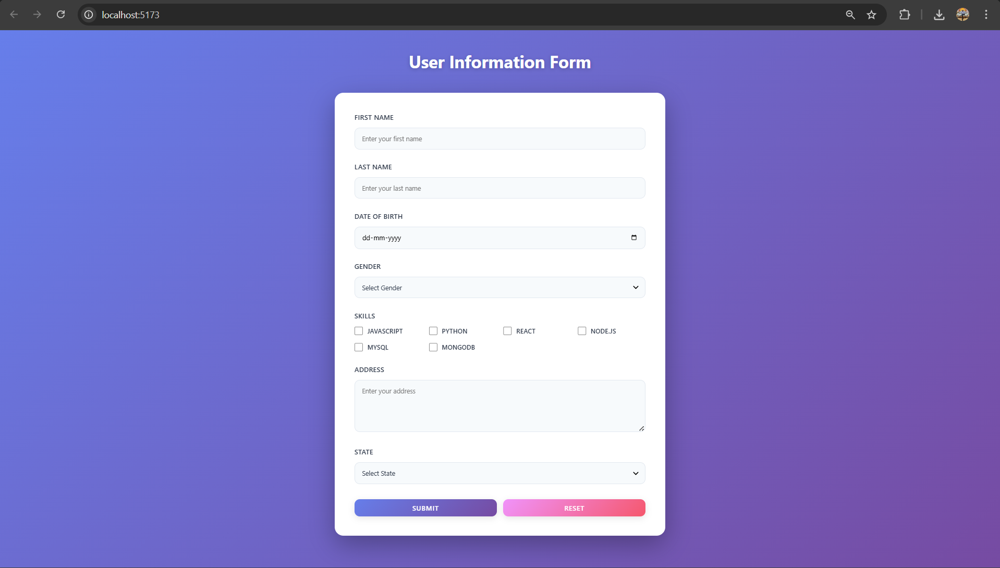
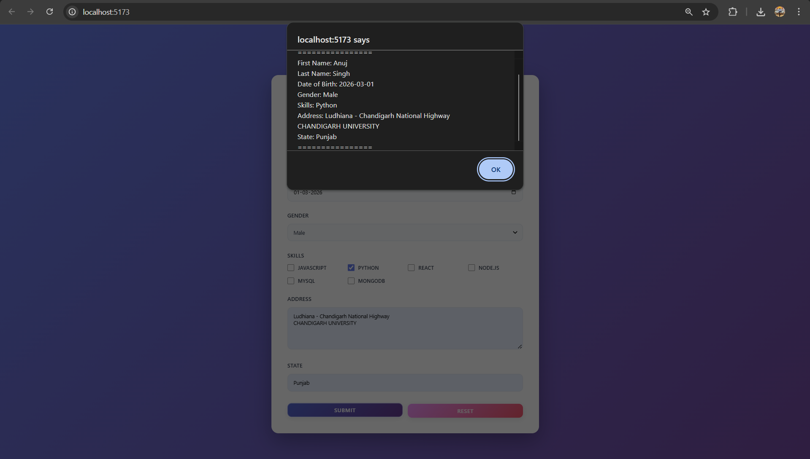

# Experiment 6.1: Handling Forms Using Controlled Components

## Aim
To create and handle forms in React using controlled components.

## Theory
Controlled components are React components where form data is managed by React state. This provides complete control over user input.

## Features
- Text input fields for First Name and Last Name
- Date of Birth picker with validation (no future dates)
- Gender dropdown selector
- Skills checkboxes (JavaScript, Python, React, Node.js, MySQL, MongoDB)
- Address textarea
- State dropdown with all Indian states and union territories
- Form submission with alert display
- Form reset functionality
- Real-time error validation
- Responsive design with modern UI

## Screenshots

### Form Interface

### Form Submission Alert

